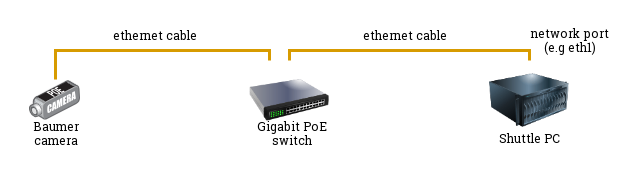

# Physical Setup
This guide lists the steps one should take to configure a _Baumer VCXG.2-51M_ camera.

In particular, it will show how to:
 * retrieve API documentation, SDK and code examples from the [Baumer](https://www.baumer.com) website
 * physically connect the camera to a Shuttle computer
 * run some sample programs to make sure the camera is connected correctly
  
## API documentation and SDK access
The documentation and SDK access for the _Baumer_ camera is available through the [Baumer](https://www.baumer.com) website. In particular, the following resources are useful:
 * [Baumer Camera Explorer](https://www.baumer.com/ch/en/product-overview/industrial-cameras-image-processing/software/baumer-camera-explorer/c/42504): a toolkit that allows to manage and interact with cameras connected to your system through a GUI
 * [Baumer GAPI SDK](https://www.baumer.com/ch/en/product-overview/industrial-cameras-image-processing/software/baumer-gapi-sdk/c/14174): a **low level SDK** (available for both `C` and `C++` clients) for interacting with the _Baumer_ camera programmatically.
 * [Baumer neoAPI](https://www.baumer.com/ch/en/product-overview/industrial-cameras-image-processing/software/baumer-neoapi/c/42528): a **high level SDK** (available for both `C`  and `C++` clients) for interactive with the _Baumer_ camera programmatically.

## Physical configuration

The following diagram is a schematic representation of how one needs to connect the _Baumer_ camera to the host PC. This setup includes:
 * the _Baumer_ camera
 * a Gigabit PoE Switch (note, PoE stands for _Power over Ethernet_, and in our case it is necessary in order to power and connect to the camera via a single physical connection)
 * a Shuttle PC
 * ethernet cables connecting the components together
  


Once the different parts are connected together, you should see that the _Baumer_ camera has a single green light (non-blinking) turned on. If you see a blinking led, the connection is incorrect.

### IP configuration
A critical part for allowing the Shuttle PC to connect to the _Baumer_ camera, relies in making sure the different components have "compatible" IP addresses. In particular, the following network configuration is necessary:
* Shuttle PC network port IP and Subnet configuration
* Camera IP and Subnet configuration

#### Shuttle network configuration

As an example: if the network interface of the Shuttle PC against which the ethernet cable is connected is `eth1` , you can check the IP configuration of that port via:
```sh
$> ip a show eth1

3: eth1: <BROADCAST,MULTICAST,UP,LOWER_UP> mtu 1500 qdisc mq state UP group default qlen 1000
    link/ether 80:ee:73:e5:82:6a brd ff:ff:ff:ff:ff:ff
    inet 192.168.1.1/24 brd 192.168.1.255 scope global eth1
       valid_lft forever preferred_lft forever
    inet6 fe80::82ee:73ff:fee5:826a/64 scope link
       valid_lft forever preferred_lft forever
```

In the above example, we understand that the `eth1`  network port of the Shuttle computer is mapped to the following IP address: `192.168.1.1` with a subnet mask (`/24`) corresponding to `255.255.255.0`. 

#### Camera network configuration

A utility tool named `gevipconfig` (distributed with both `Baumer GAPI SDK` and `Baumer neoAPI`) facilitates the configuration of the IP and Subnet for the _Baumer_ camera. A valid IP address has to be in the subnet of the network interface card, the device is connected to and has to be unique.

It is possible to manually set and persist a _static_ IP address to the _Baumer_ camera following these steps:
1. Verify the current camera IP configuration by running the `gevipconfig` tool (this is located in `tools/gevipconfig` in the `neoAPI` SDK):
   ```sh
   $> sudo ./gevipconfig

    Network Interface eth1:
    MAC:          80:EE:73:E5:82:6A
    Link Speed:   1000 MBit/s
    IPv4 Address: 192.168.1.1
    Subnet Mask:  255.255.255.0
    GEV Camera:   Baumer - VCXG.2-51M(SN: 700011810487):
        MAC:          00:06:be:12:27:2d
        IPv4 Address: 192.167.10.12
        Subnet Mask:  255.255.255.0
        Subnet Check: Wrong subnet!
   ```
   This should identify the connected camera, and report the following information:
   * the _shuttle network interface_ configuration:
     * IP address (in the example `192.168.1.1`)
     * Subnet mask (in the example `255.255.255.0`)
   * the _camera serial number_ (in the example: `700011810487`)
   * the _camera_ network configuration:
     * IP address (in the example `192.167.10.12`)
     * Subnet Mask (in the example `255.255.0.0`)
   * A verification result for the subnet-compatibility between the Shuttle and the Camera.
2. Set the IP address and the Subnet of the _Baumer_ camera to be compatible with the IP address and the Subnet of the Shuttle PC. This can be done via the following command:
   ```sh
   $> sudo ./gevipconfig -c <camera-serial-number> -i <desired-ip-address> -s <desired-subnet> -p
   ```
   **Note**: the combination of IP and subnet configurations must be a valid combination. The following are examples of correct/incorrect combinations:
   * invalid: different subnet
     ```
     NIC: IP 192.168.1.1 Subnet 255.255.255.0
     Camera: IP 192.168.2.1 Subnet 255.255.255.0
     ```
    
    * invalid: same subnet but also same IP address:
      ```
      NIC: IP 192.168.1.1 Subnet 255.255.255.0
      Camera: IP 192.168.1.1 Subnet 255.255.255.0
      ```

    * valid: same subnet and different IP address:
      ```
      NIC: IP 192.168.1.1 Subnet 255.255.255.0
      Camera: IP 192.168.1.2 Subnet 255.255.255.0
      ```
    
    To follow the valid example above, one could run the following command:
    ```sh
    $> sudo ./gevipconfig -c 700011810487 -i 192.168.1.2 -s 255.255.255.0 -p
    ```

### Verification
Once the camera and its network configuration has been completed, you can verify the correctness of the setup by running any of the pre-compiled example binaries that are distributed with the `neoAPI`  package, such as `examples/bin/getting_started_cpp`. If by running:
```sh
$> ./examples/bin/getting_started_cpp
```
you get no output, then the camera has been connected correctly.

On the other side, if by running the same command, you get the following output:
```sh
$> ./examples/bin/getting_started_cpp

error: NotConnectedException: No device with '' found.
```
it's an indicator that the setup/configuration of the Shuttle-Camera connection is incorrect.